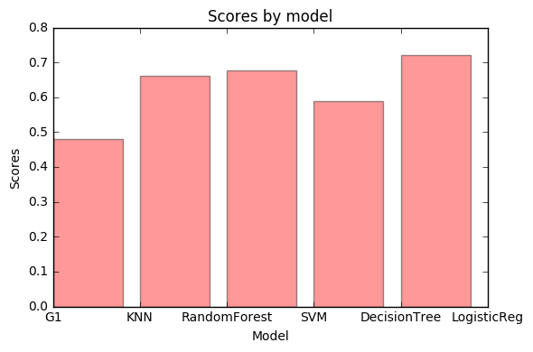
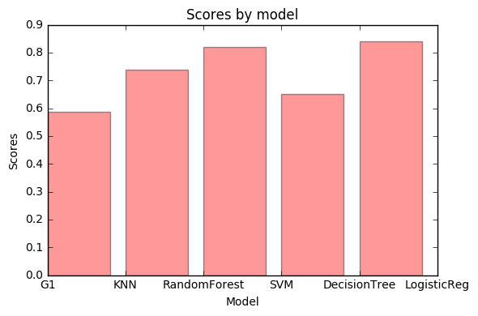

# Movies Data Project

## Miri Hazanov, Alon Maharshak

### First step-collect and preapre the data


#### During this project we will work with the "Cornell Movie-Dialogs Corpus" created by the Cornell University

Our first step is to understand the data.

* Import the relevent Packeges 
* Open the movie titles files and the movie lines file.


```python
import pandas as pd
import nltk
import re
import string 

fileName='C:/Users/Lior/Desktop/FinalProject-master/FinalProject-master/movie_lines.txt'
with open(fileName) as f:
    lines = f.readlines()
fileName='C:/Users/Lior/Desktop/FinalProject-master/FinalProject-master/movie_titles_metadata.txt'
with open(fileName) as f:
    titles = f.readlines()
```

Now lets print an exapmle so we can see how our meta data and raw data looks like


```python
print(titles[0])
print(lines[0])
```

    m0 +++$+++ 10 things i hate about you +++$+++ 1999 +++$+++ 6.90 +++$+++ 62847 +++$+++ ['comedy', 'romance']
    
    L1045 +++$+++ u0 +++$+++ m0 +++$+++ BIANCA +++$+++ They do not!
    
    

As we can see, the data has a '+++$+++' seperator, so now we can start work on the data.

Our stages we'll be:
* Create a list of each genre using the generes list in the titles file
* Get the title with the most lines in each genre so well have a lot of lines to work with
* Clean the data, getting only the movie line after cleaning of lower case and other unnecessary marks.
* Create a csv file with the Line, movie name and movie genre.

The reason we are using the Genere factor is because we want the movies to have big diffrences in style, so we can better train the model later.

### Create list function:
returns a list of all the movie id's that are relevent to a selected genre.


```python
def createList(genre):
    ans=[]
    for title in titles:
        att=title.split('+++$+++')
        if genre in att[5]:
            ans.append(att[0])
    return ans
```

### Get the movie with the most lines function


```python
def getMaxLines(movielist):
    x=0
    maxMovie=''
    for movie in movielist:
        movieline='+++$+++ '+movie+'+++$+++'
        movieLines=[line for line in lines if movieline in line]
        if len(movieLines)>x:
            x=len(movieLines)
            maxMovie=movie
    return maxMovie
```

### Clean the movie data function

* takes the raw line, strips only the movie line.
* remove from the movie line unnecessary marks and swtich to lower case 
* strip the movie name 
* Check the parameter K, that tells you how many sentences you want to put together

Returns a tuple of the movie name + a list of all the movie lines(clean)


```python
def cleanMovie(movie,k):
    num=int(movie[1:])
    movieLinesRaw=[line for line in lines if '+++$+++ '+ movie+'+++$+++' in line]
    MovieLinesClean=[]
    results=[]
    for line in movieLinesRaw:
         att=line.split('+++$+++')
         MovieLinesClean.append(att[4])
    returnLines=[]
    att=titles[num].split('+++$+++')
    results.append(att[1])
    for line in MovieLinesClean:
        line=line.lower()
        for char in string.punctuation:
            if char!="'":
                line = line.replace(char, ' ')
        line=' '.join(line.split())
        returnLines.append(line)
    
    new_results=[]
    if k>1:
        for i in range(len(returnLines)-1):
            line=''
            if i%k==0:
                line=returnLines[i]+' '+returnLines[i+1]
                new_results.append(line)
        results.append(new_results)
    else:
        results.append(returnLines)
    return results
```

### Create CSV files function:


```python
def makeCsv(movie,name,genre):
    df=pd.DataFrame()
    df['lines']=movie
    df['name']=name
    return df
```

### Now we can activate all of the stages for all the 3 movies and concatene them into one csv file:


```python
def makeDB(k):
    adventureList=createList('adventure') 
    dramaList=createList('drama') 
    comedyList=createList('comedy') 

    maxAdventure=getMaxLines(adventureList)
    maxDrama=getMaxLines(dramaList)
    maxComedy=getMaxLines(comedyList)

    movieDrama=cleanMovie(maxDrama,k)
    movieComedy=cleanMovie(maxComedy,k)
    movieAdventure=cleanMovie(maxAdventure,k)

    dramaDf=makeCsv(movieDrama[1],movieDrama[0],'Drama')
    comedyDf=makeCsv(movieComedy[1],movieComedy[0],'Comedy')
    AdventureDf=makeCsv(movieAdventure[1],movieAdventure[0],'Adventure')
    result = pd.concat([dramaDf,comedyDf,AdventureDf])
    result.to_csv('C:/Users/Lior/Desktop/FinalProject-master/FinalProject-master/MoviesLines'+str(k)+'.csv')
    return result
```

## Second part of the project:
### building calssification Model

In this part we will take the list of movie lines that we collected earlier and try to build a classification model out of it.

First we'll need to transform the vocabulary of words into features- we'll use the Bag of words technique.
We'll use the CountVectorizer package and use a "word" analyzer to get maximun features for our model.
We'll try to play with the K parameters and see when do we get the best results.

## createModels

In this function we get the movie lines as a parameter and create diffrent models, returning the result.
* We divide the set into train and test
* we create each model, fit and score.


```python
from sklearn.ensemble import RandomForestClassifier
from sklearn import svm 
from sklearn import neighbors 
from sklearn.tree import DecisionTreeClassifier
from sklearn.linear_model import LogisticRegression
from sklearn.cross_validation import KFold
def createModels(result):
    np.random.seed(123)
    x = np.random.rand(len(result['lines'])) < 0.8
    train_x = train_data_features[x]
    test_x = train_data_features[~x]
    train_y = result.loc[x,"name"]
    test_y = result.loc[~x,"name"]

    forest = RandomForestClassifier(n_estimators = 100) 
    model = forest.fit( train_x, train_y )
    forestScore=model.score(test_x,test_y)
    print("RandomForestClassifier: {}".format(forestScore))

    knn = neighbors.KNeighborsClassifier(3) 
    model=knn.fit(train_x, train_y) 
    knnScore = model.score(test_x,test_y) 
    print("knn: {}".format(knnScore))

    svml = svm.LinearSVC() 
    model=svml.fit(train_x, train_y) 
    svmScore=model.score(test_x,test_y)
    print("svm: {}".format(svmScore))

    tree = DecisionTreeClassifier()
    model = tree.fit( train_x, train_y )
    treeScore=model.score(test_x,test_y)
    print("DecisionTreeClassifier: {}".format(treeScore))

    Reg = LogisticRegression()
    model = Reg.fit( train_x, train_y )
    RegScore=model.score(test_x,test_y)
    print("LogisticRegression: {}".format(RegScore))
    data=[knnScore,forestScore,svmScore,treeScore,RegScore]
    return data
```

### Visualization:

Thiss function gets all of the models scores and create a bar graph so we can see which model is best


```python
def createPlot(data):
    import matplotlib.pyplot as plt
    fig, ax = plt.subplots()
    ax.set_ylabel('Scores')
    plt.xlabel('Model')
    ax.set_title('Scores by model')
    index = np.arange(5)
    plt.bar(index,data,alpha=0.4, color='r',label='Model')
    ax.set_xticklabels(('G1', 'KNN', 'RandomForest', 'SVM', 'DecisionTree','LogisticReg'))
    plt.tight_layout()
    plt.show()
```

## Build the Model:
### Main program

After we created all the function that we need we'll do the following steps.
1. create a data set, each time using a difftrent K(how many sentences do we want to put together)
2. Create the BOW with 5000 features
3. Create the models and return the scores for each one.
4. Plot the scores and see which model is the best.


```python
from sklearn.feature_extraction.text import CountVectorizer
import numpy as np
result=makeDB(1)
vectorizer = CountVectorizer(analyzer = "word", tokenizer = None,preprocessor = None,stop_words = None,max_features = 5000)
train_data_features = vectorizer.fit_transform(result['lines'])
train_data_features = train_data_features.toarray()
vocab = vectorizer.get_feature_names()
dist = np.sum(train_data_features, axis=0)
print(train_data_features.shape)
data=createModels(result)
createPlot(data)
```

    (3997L, 2886L)
    RandomForestClassifier: 0.632627646326
    knn: 0.488169364882
    svm: 0.673723536737
    DecisionTreeClassifier: 0.552926525529
    LogisticRegression: 0.678704856787
    


### We can see that when we address each sentence separately the highest score is 67.8% with the Logisitc Regression model.

Now let's see what happen when we increase our K.

### We'll run a loop from 2 to 5, and see which K gives us the best reuslts


```python
for i in range(2,6):
    result=makeDB(i)
    vectorizer = CountVectorizer(analyzer = "word", tokenizer = None,preprocessor = None,stop_words = None,max_features = 5000)
    train_data_features = vectorizer.fit_transform(result['lines'])
    train_data_features = train_data_features.toarray()
    vocab = vectorizer.get_feature_names()
    dist = np.sum(train_data_features, axis=0)
    print(train_data_features.shape)
    data=createModels(result)
    createPlot(data)
```

    (1998L, 2886L)
    RandomForestClassifier: 0.653937947494
    knn: 0.513126491647
    svm: 0.73031026253
    DecisionTreeClassifier: 0.546539379475
    LogisticRegression: 0.747016706444
    


    (1332L, 2384L)
    RandomForestClassifier: 0.661654135338
    knn: 0.481203007519
    svm: 0.676691729323
    DecisionTreeClassifier: 0.59022556391
    LogisticRegression: 0.721804511278
    





    (1000L, 1980L)
    RandomForestClassifier: 0.717171717172
    knn: 0.525252525253
    svm: 0.69696969697
    DecisionTreeClassifier: 0.550505050505
    LogisticRegression: 0.752525252525
    


    (800L, 1780L)
    RandomForestClassifier: 0.602409638554
    knn: 0.475903614458
    svm: 0.668674698795
    DecisionTreeClassifier: 0.512048192771
    LogisticRegression: 0.674698795181
    


## Results:

1. AS we can see The scores were better with higher K until we reached the value of 5. 
2. In all of our model, Logistic regression was the best fit.
3. the best score was 75.5% that was achived when K=4.

## Third and Forth part of the project:
### building kares Model for generate sentences


```python
import numpy as np
import theano
import keras
import pandas as pd
import random
```


```python
from keras.models import Sequential
from keras.layers.core import Dense, Activation, Flatten
from keras.layers.wrappers import TimeDistributed
from keras.layers.embeddings import Embedding
from keras.layers.recurrent import LSTM
from keras.preprocessing.text import Tokenizer
from keras.preprocessing.text import text_to_word_sequence
```

### After we finished importing all the data we can start preparing it.

## Create a model function
 We created a function that gets the movie text and create a squential nuernal network using embedding technique.
 
 We turn the text into word matrix, compile and fit the model.


```python
def makeModel(movie):
    text2 = text_to_word_sequence(movie, lower=False, split=" ") #using only 10000 first words
    token = Tokenizer(nb_words=2000,char_level=False)
    token.fit_on_texts(text2)
    text_mtx = token.texts_to_matrix(text2, mode='binary')

    text_mtx.shape

    input_ = text_mtx[:-1]
    output_ = text_mtx[1:]
    input_.shape, output_.shape

    model = Sequential()
    model.add(Embedding(input_dim=input_.shape[1],output_dim= 42, input_length=input_.shape[1]))
    model.add(Flatten())
    model.add(Dense(output_.shape[1], activation='sigmoid'))
    model.compile(loss='categorical_crossentropy', optimizer='rmsprop',metrics=["accuracy"])
    model.fit(input_, y=output_, batch_size=300, nb_epoch=7, verbose=1, validation_split=0.2)
    return model
```

## get next word function

We'll create a function thet gets the word metrix and randommaly select a word from it in order to create a new sentence.


```python
def get_next(text,token,model,fullmtx,fullText):
    tmp = text_to_word_sequence(text, lower=False, split=" ")
    tmp = token.texts_to_matrix(tmp, mode='binary')
    p = model.predict(tmp)
    x= np.random.random_sample()*1000
    return fullText[int(x)]
```

## Create new sentence.

According to the movie text and the relevenat model for each movie, we're creating new sentences.

1) total of 350 sentences for each movie.
2) Length of sentence is between 2 and 12 word.


```python
def createSentences(model,movie):
    text2 = text_to_word_sequence(movie, lower=False, split=" ") #using only 10000 first words
    token = Tokenizer(nb_words=2000,char_level=False)
    token.fit_on_texts(text2)
    text_mtx = token.texts_to_matrix(text2, mode='binary')
    text_mtx.shape
    word="b"
    newLine=[]
    for j in range(0,350):
        y=""
        k=int(random.random()*10+2)
        for i in range(0,k):
            word=get_next(word,token,model,text_mtx,text2)
            y=y+' '+word
        newLine.append(y)
    
    return newLine

```

## Make it happen.

Now we use the function that we created in order to:
1) create one string for each movie
2) create 3 models of each movie
3) create new sentences for each movie and make them into a list


```python
lines=pd.read_csv("C:/Users/Lior/Desktop/FinalProject-master/FinalProject-master/MoviesLines2.csv")
lines1=lines[lines.name == ' casino ']
lines2=lines[lines.name == ' chill factor ']
lines3=lines[lines.name == ' innerspace ']
text1=lines1["lines"]
text2=lines2["lines"]
text3=lines3["lines"]

movie1=' '.join(line for line in text1)
movie2=' '.join(line for line in text2)
movie3=' '.join(line for line in text3)

model1=makeModel(movie1)
model2=makeModel(movie2)
model3=makeModel(movie3)

newLines1=createSentences(model1,movie1)
newLines2=createSentences(model2,movie2)
newLines3=createSentences(model3,movie3)

```

    Train on 13478 samples, validate on 3370 samples
    Epoch 1/7
    13478/13478 [==============================] - 321s - loss: 6.4801 - acc: 0.0146 - val_loss: 6.2197 - val_acc: 0.0145
    Epoch 2/7
    13478/13478 [==============================] - 319s - loss: 6.0435 - acc: 0.0174 - val_loss: 6.2399 - val_acc: 0.0582
    Epoch 3/7
    13478/13478 [==============================] - 319s - loss: 5.9135 - acc: 0.0507 - val_loss: 6.2828 - val_acc: 0.0582
    Epoch 4/7
    13478/13478 [==============================] - 319s - loss: 5.7432 - acc: 0.0507 - val_loss: 6.0929 - val_acc: 0.0582
    Epoch 5/7
    13478/13478 [==============================] - 319s - loss: 5.5315 - acc: 0.0507 - val_loss: 6.0181 - val_acc: 0.0608
    Epoch 6/7
    13478/13478 [==============================] - 320s - loss: 5.2741 - acc: 0.0881 - val_loss: 5.8455 - val_acc: 0.0994
    Epoch 7/7
    13478/13478 [==============================] - 320s - loss: 5.0126 - acc: 0.1134 - val_loss: 5.8379 - val_acc: 0.1083
    Train on 5605 samples, validate on 1402 samples
    Epoch 1/7
    5605/5605 [==============================] - 133s - loss: 7.1055 - acc: 0.0152 - val_loss: 6.8974 - val_acc: 0.0221
    Epoch 2/7
    5605/5605 [==============================] - 133s - loss: 6.3612 - acc: 0.0202 - val_loss: 7.0153 - val_acc: 0.0221
    Epoch 3/7
    5605/5605 [==============================] - 133s - loss: 6.2731 - acc: 0.0202 - val_loss: 7.0610 - val_acc: 0.0221
    Epoch 4/7
    5605/5605 [==============================] - 133s - loss: 6.2145 - acc: 0.0202 - val_loss: 7.1050 - val_acc: 0.0221
    Epoch 5/7
    5605/5605 [==============================] - 133s - loss: 6.1433 - acc: 0.0202 - val_loss: 7.1767 - val_acc: 0.0221
    Epoch 6/7
    5605/5605 [==============================] - 133s - loss: 6.0800 - acc: 0.0232 - val_loss: 7.1529 - val_acc: 0.0200
    Epoch 7/7
    5605/5605 [==============================] - 133s - loss: 6.0034 - acc: 0.0348 - val_loss: 7.2849 - val_acc: 0.0292
    Train on 4923 samples, validate on 1231 samples
    Epoch 1/7
    4923/4923 [==============================] - 119s - loss: 6.8800 - acc: 0.0134 - val_loss: 6.4871 - val_acc: 0.0057
    Epoch 2/7
    4923/4923 [==============================] - 118s - loss: 6.0500 - acc: 0.0130 - val_loss: 6.4891 - val_acc: 0.0057
    Epoch 3/7
    4923/4923 [==============================] - 118s - loss: 5.9239 - acc: 0.0140 - val_loss: 6.5758 - val_acc: 0.0284
    Epoch 4/7
    4923/4923 [==============================] - 118s - loss: 5.8515 - acc: 0.0286 - val_loss: 6.5374 - val_acc: 0.0284
    Epoch 5/7
    4923/4923 [==============================] - 118s - loss: 5.7887 - acc: 0.0353 - val_loss: 6.5445 - val_acc: 0.0284
    Epoch 6/7
    4923/4923 [==============================] - 118s - loss: 5.7126 - acc: 0.0353 - val_loss: 6.8179 - val_acc: 0.0284
    Epoch 7/7
    4923/4923 [==============================] - 118s - loss: 5.6586 - acc: 0.0376 - val_loss: 6.5428 - val_acc: 0.0382
    


    ---------------------------------------------------------------------------

    KeyError                                  Traceback (most recent call last)

    <ipython-input-152-10acf99fc11d> in <module>()
         15 model3=makeModel(movie3)
         16 
    ---> 17 newLines1=createSentences(model1)
         18 newLines2=createSentences(model2)
         19 newLines3=createSentences(model3)
    

    <ipython-input-149-6c6fcdc7e3fb> in createSentences(model)
          6         k=int(random.random()*10+2)
          7         for i in range(0,k):
    ----> 8             x=get_next(x,token,model,text_mtx,text2)
          9             y=y+' '+x
         10         newLine.append(y)
    

    <ipython-input-148-da653e577cda> in get_next(text, token, model, fullmtx, fullText)
          4     p = model.predict(tmp)
          5     x= np.random.random_sample()*2000
    ----> 6     return fullText[int(x)]
    

    C:\Users\Lior\Anaconda2\lib\site-packages\pandas\core\series.pyc in __getitem__(self, key)
        581         key = com._apply_if_callable(key, self)
        582         try:
    --> 583             result = self.index.get_value(self, key)
        584 
        585             if not lib.isscalar(result):
    

    C:\Users\Lior\Anaconda2\lib\site-packages\pandas\indexes\base.pyc in get_value(self, series, key)
       1978         try:
       1979             return self._engine.get_value(s, k,
    -> 1980                                           tz=getattr(series.dtype, 'tz', None))
       1981         except KeyError as e1:
       1982             if len(self) > 0 and self.inferred_type in ['integer', 'boolean']:
    

    pandas\index.pyx in pandas.index.IndexEngine.get_value (pandas\index.c:3332)()
    

    pandas\index.pyx in pandas.index.IndexEngine.get_value (pandas\index.c:3035)()
    

    pandas\index.pyx in pandas.index.IndexEngine.get_loc (pandas\index.c:4018)()
    

    pandas\hashtable.pyx in pandas.hashtable.Int64HashTable.get_item (pandas\hashtable.c:6610)()
    

    pandas\hashtable.pyx in pandas.hashtable.Int64HashTable.get_item (pandas\hashtable.c:6554)()
    

    KeyError: 1691L


## Create CSV's 

Next steps:

1) create csv for each new lines list
2) concat all of them into one file in order to classify them


```python
df1 = pd.DataFrame(np.array(newLines1))
df1.to_csv('C:/Users/Lior/Desktop/FinalProject-master/FinalProject-master/newLines1.csv')
df2= pd.DataFrame(np.array(newLines2))
df2.to_csv('C:/Users/Lior/Desktop/FinalProject-master/FinalProject-master/newLines2.csv')
df3= pd.DataFrame(np.array(newLines3))
df3.to_csv('C:/Users/Lior/Desktop/FinalProject-master/FinalProject-master/newLines3.csv')
result = pd.concat([df1,df2,df3])
result.to_csv('C:/Users/Lior/Desktop/FinalProject-master/FinalProject-master/newLines.csv')
```

## Final step - classiffy

Like before

1) Read the new Lines
2) creare data features
3) train the data on the models. 
4) Plot the results


```python
np.random.seed(123)
result=pd.read_csv("C:/Users/Lior/Desktop/FinalProject-master/FinalProject-master/newLines.csv")
vectorizer = CountVectorizer(analyzer = "word", tokenizer = None,preprocessor = None,stop_words = None,max_features = 5000)
train_data_features = vectorizer.fit_transform(result['lines'])
train_data_features = train_data_features.toarray()
vocab = vectorizer.get_feature_names()
dist = np.sum(train_data_features, axis=0)
print(train_data_features.shape)
data=createModels(result)
createPlot(data)
```

    (1050L, 726L)
    RandomForestClassifier: 0.73786407767
    knn: 0.587378640777
    svm: 0.820388349515
    DecisionTreeClassifier: 0.650485436893
    LogisticRegression: 0.839805825243
    





# Results:

** We can see that with the Logistic regressing we got a 0.84 results and 0.82 with svm. **
